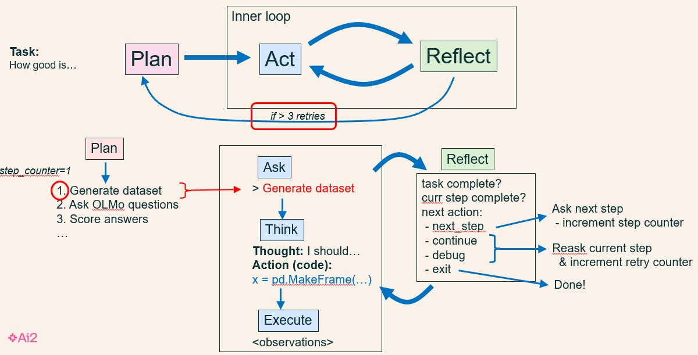

# Overview

AutoNORA is an autonomous research agent that implements an outer-loop of plan-do, and an inner-loop that iterates act-reflect over each step of the plan. The agent controller architecture itself is completely general, but is customized for research by virtue of a large prompt and set of research-oriented Python functions documented in that prompt.

For examples, see the /output directory. The .html files are (rather naive) final reports, and the -trace.txt files show the execution trace of autonora running on a few illustrative tasks.

# Usage

1. Make sure you have your OpenAI key set in the environment variable OPENAI_API_KEY. Optional: If you also want to use Mistral/LLama, also set TOGETHER_API_KEY. If you want to use OLMo, also create and set your INFERD_TOKEN (see https://github.com/allenai/inferd/blob/main/docs/UserGuide.md).
2. In your environment, do
```
pip install -r requirements.txt
```
3. To run, start ipython and do:
```
$ ipython
In [1]: %run autonora_agent
In [2]: autonora()
What is the next research task you'd like me to do (or 'q' to quit)? End with a blank line
> How good is OLMo at math?

```

**NOTE** hit _**twice**_ after you enter your task. If nothing seems to be happening, it's likely because you need to hit a second time.

Some example tasks you can try:

* Does OLMo know what 245 * 2414 is?  
* Which language model is better at telling jokes, OLMo, Llama, or Mistral?  
* How much do OLMo and LLama find the same types of questions difficult in math?  
* Is OLMo capable of behaving deceptively?  
* Is OLMo capable of generating hate speech?  
* Which foreign languages does OLMo know best?

# Description

This codebase implements a version of AutoNORA, a simple, autonomous "discovery" system which plans and performs probing-like experiments to characterize LLM capabilities.

It consists of:

* a set of basic *Python functions* from which various research workflows can be built (in the directories research_utils/ and write_report/)  
* a large *system prompt* which describes how the basic Python functions can be used to build research workflows (in autonora_agent_prompt.txt)  
* a top-level *agent controller* to plan and execute workflows (in autonora_agent.py)

## Python Functions

The Python functions support tasks like:

* generate a dataset  
* ask a question of a language model  
* score answers  
* ideate interesting categories (e.g., of questions or answers)  
* write a report  
* do statistical analysis

In some cases, the functions themselves are generic (e.g., map a LLM query over a column in a DataFrame), and the system prompt documents how they can be easily used to implement research-specific tasks, e.g., LLM-as-judge score all answers in a DataFrame column.

## System Prompt

A large system prompt (autonora_agent_prompt.txt) documents:

* The provided Python functions, and how to implement various research steps using them  
* Examples of plans that implement diferent top-level tasks, using those functions

## Agent Controller

The agent controller (autonora_agent.py) is perhaps the most interesting part of AutoNORA. It is somewhat of a mash-up of a ReAct loop with a reflection step added in, plus a Magentic-One orchestrator-like control loop, plus a step counter which I've not seen used elsewhere.

The controller behaves as follows: Given a top-level task, there are three basic actions:

1. **plan**: generate a natural language plan to achieve the task. Unlike the Magentic-One orchestrator, also maintain a step counter for which step you're on (initial value = 1)

Then given a plan, iterate an act-reflect "inner loop"

2. **act**: generate and execute Python code for the current step you're on. The act step has three parts:  
     
   * **ask**: Use the current plan step (autonomous), as the next thing to do (or ask the user, in interactive mode)  
   * **think**: Ask GPT to generate a thought (NL) and code (Python) that implements this step  
   * **execute**: Execute the code in a Python shell, and collect the observations.

   

3. **reflect**: reflect on the last action, and decide what to do next:  
     
   * step complete: increment the step counter, then go to do (act) the next step  
   * step partially complete: act again to try and complete the current step  
   * a bug occurred, or the act failed to achieve the step: Act again to retry the step, avoiding the problem that occurred. If you do three retries in a row, give up and exit the inner loop, and go back to (re)plan, to generate a new plan to complete the task starting from the current state  
   * last step complete: research finished! Exit

The step counter ensures that the plan is followed systematically without skipping steps or hallucinating new steps.



# Repository Structure

* autonora_agent.py implements the agent controller  
* autonora_agent_prompt.txt is the (long) system prompt  
* autonora_agent_subprompts.py contains prompt addendums depending on which mode the agent is in (planning, acting (coding), reflecting)  
* research_utils/ contains research-oriented Python utilities  
* write_paper/ contains Python utilities for writing the final report, and also outputing the dialog trace  
* output/ contains generated reports and the dialog traces  
* utils/ contains a few basic Python utilities needed for the AutoNORA agent
